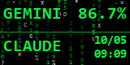

# MSU2 MINI Antigravity Token Monitor (Matrix Style)

> 專為 **MSU2 MINI (160×80)** USB 智慧小螢幕打造，即時顯示 **Antigravity (Google / Claude / GPT)** 模型的剩餘用量與冷卻時間。  
> 採用經典駭客任務綠（Matrix Rain）像素級平滑數碼雨背景，極致輕量、無感常駐。



---

## ✨ 核心特色

1. **本地端點直讀（零 API Key 需求）**
   - 逆向直連 Antigravity 本地語言伺服端點 (`RetrieveUserQuotaSummary`)。
   - 完全不需要填寫任何 OpenAI / Anthropic / Google 商業 API Key，直接反映目前 IDE 內的真實配額。

2. **智慧配額分桶與冷卻切換**
   - **正常狀態**：固定顯示 `5-Hour Limit` 即時剩餘百分比（例：`GEMINI 86.7%`）。
   - **額度耗盡時**：當 5 小時或週額度歸零時，**自動切換顯示額度回復的日期與時間**（例：`CLAUDE 10/05 09:09`），時間一到自動切回百分比。

3. **極致輕量與硬體優化**
   - **記憶體**：獨佔記憶體（Private RAM）僅 **~23 MB**。
   - **CPU 佔用**：約 **0.3% ~ 1.0%**。
   - **SSD 保護**：平時 0 Disk I/O，僅在配額發生變動時寫入狀態快取。
   - **硬體傳輸**：針對 CH340 序列埠實作 RLE 像素壓縮傳輸，以 9.0 FPS 達成絲滑下落動畫。

4. **開機靜默常駐**
   - 內建一鍵註冊 Windows 開機自啟，開機完全無黑窗閃爍（透過 `wscript.exe` 靜默啟動）。

---

## 🛠️ 硬體與環境需求

- **硬體**：MSU2 MINI 160×80 USB 串口液晶小螢幕（晶片通常為 CH340）
- **作業系統**：Windows 10 / 11
- **Python**：Python 3.10+
- **必要套件**：
  ```bash
  pip install -r requirements.txt
  ```

---

## 🚀 快速開始

### 1. 安裝相依套件
```bash
pip install pillow pyserial
```

### 2. 隨選啟動 / 停止
- 雙擊執行 `啟動_雙模型監控.bat`（自動尋找可用串口與背景啟動）。
- 雙擊執行 `停止_雙模型監控.bat`。

### 3. 設定開機自動常駐
- 雙擊執行 `設定開機自動啟動_雙模型監控.bat` 即可註冊至 Windows 啟動資料夾。
- 若需取消，雙擊執行 `取消開機自動啟動_雙模型監控.bat`。

---

## 📁 檔案結構

```text
├── dual_usage_monitor.py             # 核心監控程序 (串流傳輸至小螢幕)
├── dual_usage_display.py             # 數碼雨動畫引擎與排版渲染 (PIL)
├── usage_provider.py                 # 本地 Connect-RPC 配額擷取模組
├── start_dual.ps1 / stop_dual.ps1    # 背景進程啟動與關閉腳本
├── start_dual_monitor.vbs            # 靜默無黑窗啟動腳本
├── 啟動_雙模型監控.bat               # 隨選啟動快捷檔
├── 停止_雙模型監控.bat               # 停止快捷檔
├── 設定開機自動啟動_雙模型監控.bat   # 註冊開機自啟
├── 取消開機自動啟動_雙模型監控.bat   # 移除開機自啟
├── requirements.txt                  # 套件依賴
├── .gitignore                        # Git 忽略名單
└── README.md                         # 專案說明文件
```

---

## 📄 授權條款

本專案採用 [MIT License](LICENSE) 授權。
